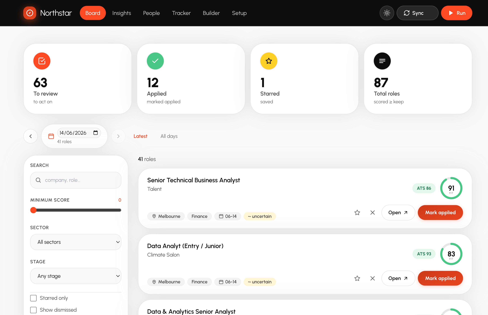
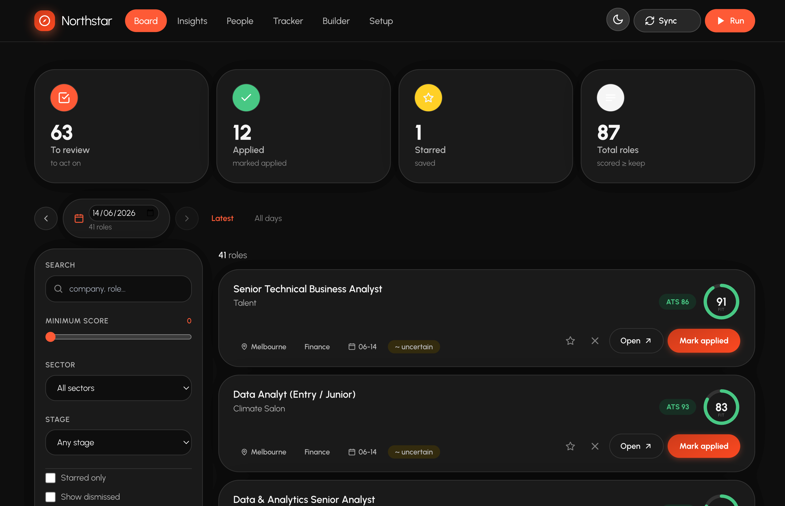
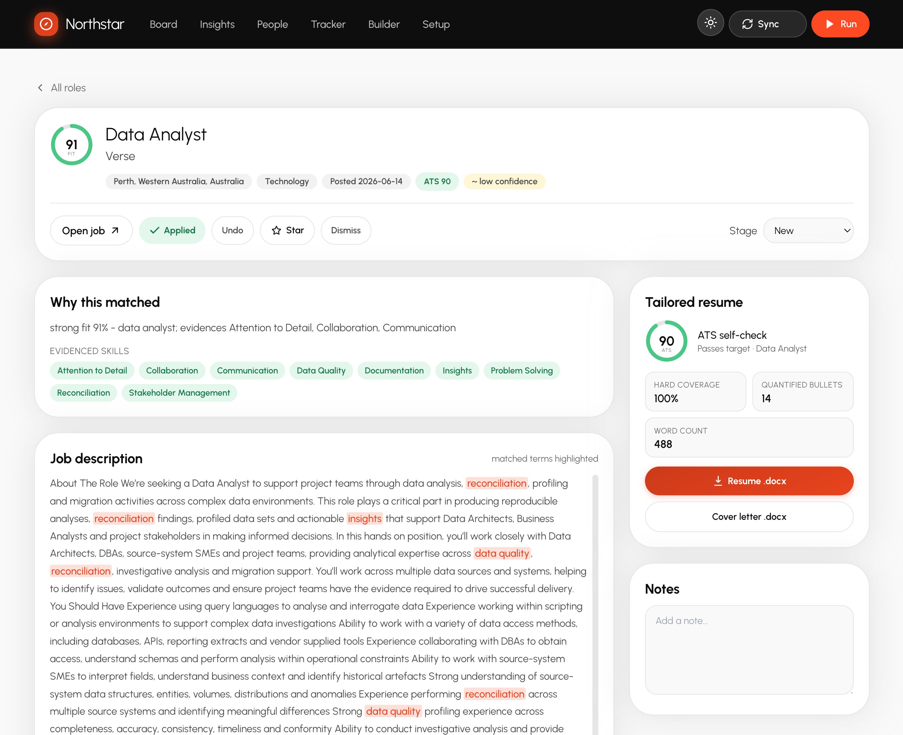
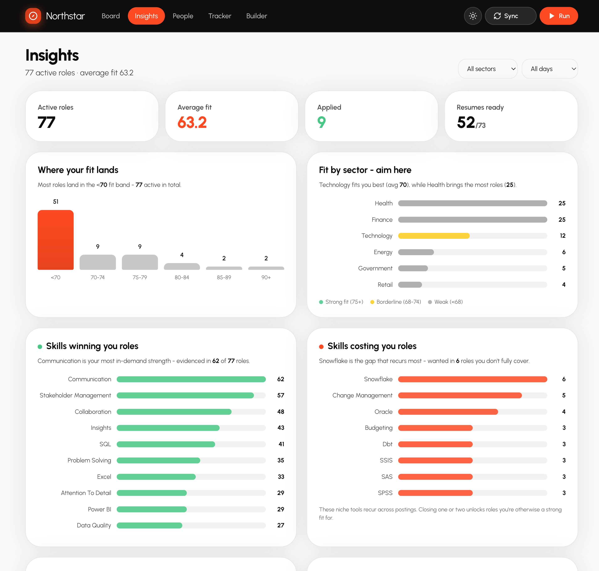
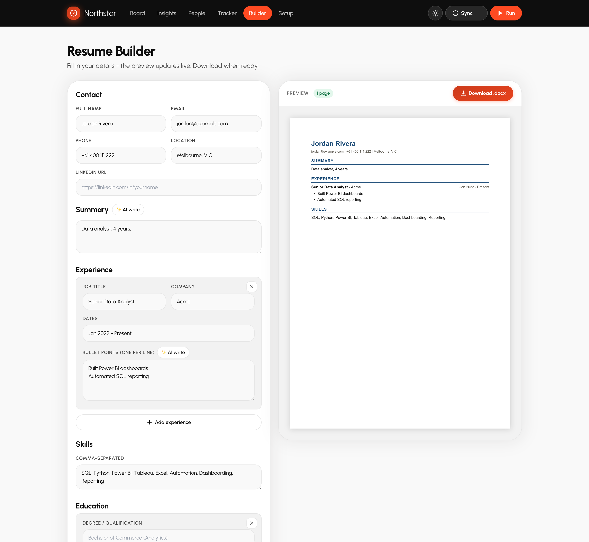
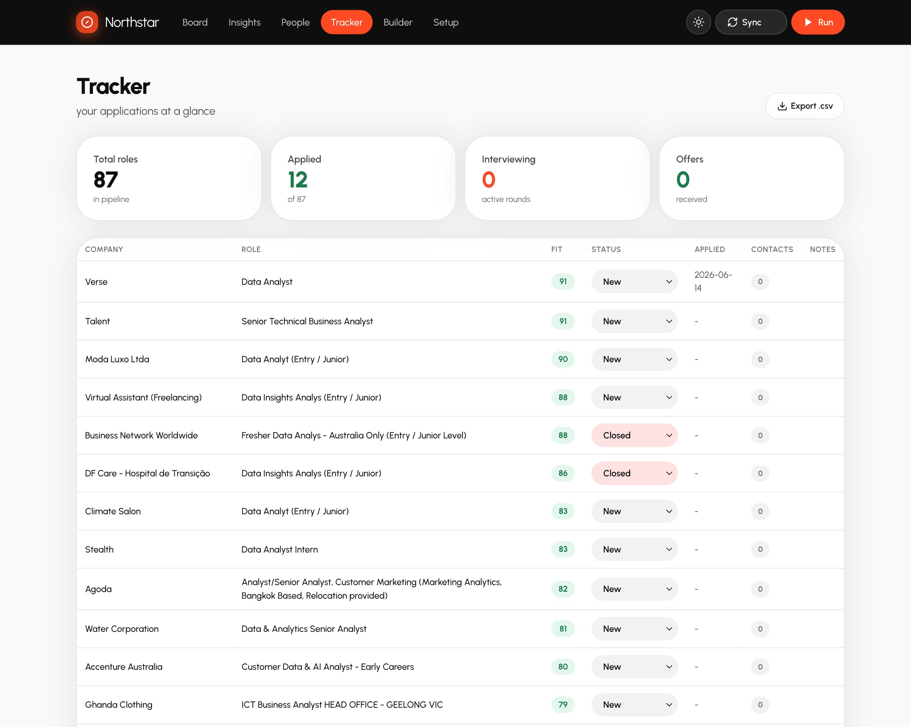
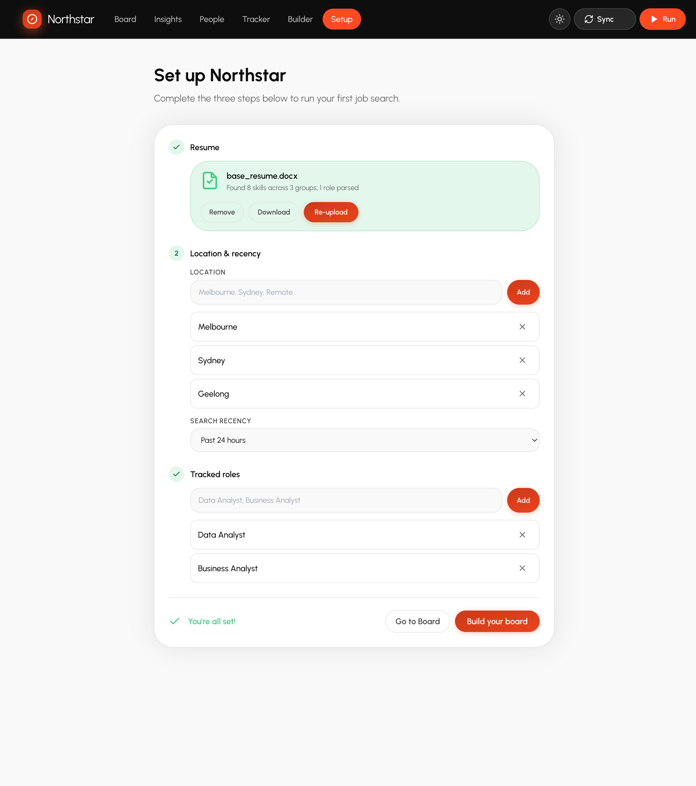

<h1 align="center">Northstar</h1>

<p align="center"><strong>Your job hunt, finally under control.</strong></p>

<p align="center">
Northstar turns the chaos of a job search (forty open tabs, a spreadsheet you stopped updating, the same résumé fired at every role) into one calm dashboard that pulls live postings, ranks them by how well they fit <em>you</em>, and remembers everything. It runs entirely on your own machine. Your résumé and your data never leave it.
</p>

<p align="center">
  
  
  
  
</p>

<p align="center">
  
</p>

---

## The problem

If you have ever job-hunted seriously, you know the drill.

You open ten tabs of listings. You start a spreadsheet to "stay organised." By Thursday the spreadsheet is three days stale and you genuinely cannot remember whether you applied to that one good role or just meant to. You send the **same résumé** to a data-analyst job and a BI job because tailoring each one by hand is exhausting. Half your applications vanish into an ATS black hole. And the best-fit role, the one actually worth your energy, is buried somewhere on page four, looking identical to forty roles that aren't worth it.

Job hunting is a second full-time job, and the tooling for it is a browser with too many tabs and a sense of guilt.

**The real cost isn't the admin. It's the good roles you never properly chased because everything blurred together.**

## Why I built this

I built Northstar while job-hunting myself. I didn't want another cloud SaaS that wanted my résumé, my email, and a subscription. I wanted one quiet place on my own laptop that could answer three questions every morning:

1. *What's actually new today?*
2. *Which of these genuinely fit my skills, not just keyword-match, but fit?*
3. *What have I already done about each one?*

Northstar is the answer to those three questions. It's free, it's open-source, and it's yours.

## What it does

Northstar runs the whole loop (find, rank, tailor, track) from a single button.

### Find and rank every role by real fit

It pulls live postings for your target roles and scores each one with a transparent **Fit %**: the share of *that posting's* requirements your skills actually cover. No keyword soup, no black-box ML. The same inputs always produce the same score, and every score is explainable. The best-fit roles rise to the top, and the day nav lets you work through today's batch and leave the rest for later.

<p align="center">
  
  <br><em>Light or dark, every role ranked by how well it fits you, newest first.</em>
</p>

### See exactly why a role matched

Open any posting to see the full job description with your matched requirements highlighted, the score breakdown, and your tailored résumé right there. *Open* and *Mark applied* are deliberately separate buttons, so opening a link never silently marks it done.

<p align="center">
  
  <br><em>Every score is explainable: the requirements you cover, the gaps, and the JD terms to add.</em>
</p>

### Understand your whole hunt at a glance

The Insights page turns your pipeline into a story: where your Fit scores cluster, which sectors are hiring, which skills keep costing you roles, and how far each application has progressed.

<p align="center">
  
  <br><em>Stop guessing whether the hunt is working. See it.</em>
</p>

### Build a clean, ATS-safe résumé in minutes

The Builder is a from-scratch résumé editor: fill in your details on the left, watch an ATS-safe single-column résumé render live on the right, and download a clean `.docx` in one click. Everything is your own content, nothing is invented. Optional AI assistance (strictly opt-in, your own API key) turns rough notes into polished bullet points, with a hard guard against fabricating or moving numbers.

<p align="center">
  
  <br><em>Edit on the left, watch it render on the right, download a clean .docx.</em>
</p>

### Never lose track again

One **Run** button does everything (search, fetch descriptions, dedupe, score, rebuild the board) in the background with a live progress bar. Your applied, starred, and noted state, plus any contacts you add, live in a separate database zone that **survives every run**, so a daily refresh never wipes your work.

<p align="center">
  
  <br><em>Every application in one editable table. Nothing slips through the cracks.</em>
</p>

---

## Your data stays yours

> ### Local and self-hosted, read this first
> Northstar runs entirely on your own computer. There is no account, no cloud, no subscription, and nothing is ever uploaded. **You are the operator**, and you are responsible for complying with the terms of service of any site it fetches from (including LinkedIn). It is intended for personal job-seeking use at human volume. The software is provided **as-is, with no warranty** (see `LICENSE`).

The scorer is fully deterministic: no LLM, no ML, no telemetry. The only part that can call a model is the optional AI résumé helper, and it only runs if *you* supply an API key.

## Getting started, two steps to your first ranked board

```bash
# Clone and launch — creates the venv, installs everything, opens the app
git clone https://github.com/Nam-Aniket/northstar.git && cd northstar
python3 bootstrap.py            # macOS/Linux: ./run.sh   ·   Windows: run.bat
```

The app opens on the **Setup** page. Drop in your résumé — Northstar reads your skills straight from it — then add your locations and target roles and click **Build your board**. It fetches today's postings, scores each by Fit %, and refreshes your board. That's the whole loop; no terminal needed past the launch above. (Prefer the terminal? `python daily_run.py` runs the same fetch-score-build, and `python build_profile.py --resume your_resume.docx` rebuilds your skills without the UI.)

<p align="center">
  
  <br><em>A guided first run: drop in your résumé, pick your locations and roles, build your board.</em>
</p>

> `bootstrap.py` is idempotent. Later runs only re-install when `requirements.txt` changes, then launch immediately. Pass `--no-launch` for CI or setup-only.

### Run it daily, hands-free (optional)

Point any scheduler at `daily_run.py`:

- **macOS (launchd):** fill the two `__PLACEHOLDERS__` in `scripts/com.northstar.dailyrun.plist.template`, copy to `~/Library/LaunchAgents/com.northstar.dailyrun.plist`, then `launchctl load` it.
- **Linux/macOS (cron):** `30 8 * * * cd <ROOT> && <venv>/bin/python daily_run.py >> app/daily_run.log 2>&1`
- **Windows (Task Scheduler):** `schtasks /Create /SC DAILY /ST 08:30 /TN NorthstarDaily /TR "<python> <ROOT>\daily_run.py"`

## Configure your profile

| File | What it holds | How to fill it |
|---|---|---|
| `skills.json` | `supported_skills` (what you can claim) plus `unsupported_skills` (gaps). Drives your Fit %. | `python build_profile.py --resume your_resume.docx`, then review. |
| `config.json` | Identity line, `target_keywords`, `target_location`, `recency_tpr` (`r86400` = 24h), `needs_sponsorship`, `seniority_cap`, `keep_threshold`. | `cp config.example.json config.json` and edit. |
| `facts.json` *(optional)* | Real experience for tailored résumé generation: `FACT_BANK`, `EXPERIENCE_SLOTS`, `BULLET_BUDGETS`. | `cp facts.example.json facts.json`, fill in, set `generation_enabled: true`. |

All three are **gitignored**, so your real content is never committed.

## How the Fit score works

For each job, Northstar finds which of the posting's requirements you can evidence, which you can't, and which it couldn't classify:

```
Fit % ≈ covered ÷ (covered + lacked + unclassified)
```

Requirements in the JD's "must-have" section count double. Hard gates (for example a role demanding citizenship you don't hold) apply as multiplicative **caps**, never floors, so a posting with none of your skills scores low, not high. To avoid over-confidence on thin postings, the denominator is **Laplace-smoothed**, and a "~ uncertain" flag appears when a JD has too few recognised requirements to score confidently. The ranking is the product; the strong and fair bands are advisory.

## Project layout

```
00_search_linkedin_guest.py   search live postings for your roles
fill_missing_jds.py           fetch full job-description text
prepare_job_posts.py          dedupe + authenticity filter
score_jobs.py                 the Fit % scorer (reads skills.json/config.json)
config.py                     loads skills.json / config.json / facts.json
build_profile.py              generate skills.json from your résumé
daily_run.py                  one-shot full refresh (search, score, dashboard)
generate_accepted_resumes.py  tailored-résumé engine (opt-in)
resume_docx.py                ATS-safe .docx writer used by the Builder
app/                          the local FastAPI + HTMX web app
scripts/                      opt-in daily-run scheduler templates
docs/                         deeper guides + screenshots
```

## License

MIT, see [`LICENSE`](LICENSE). Build on it, fork it, make it yours.
